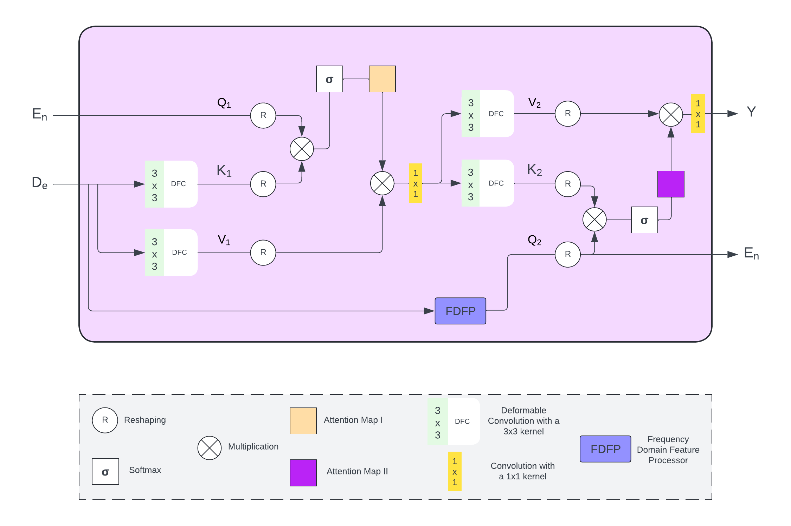
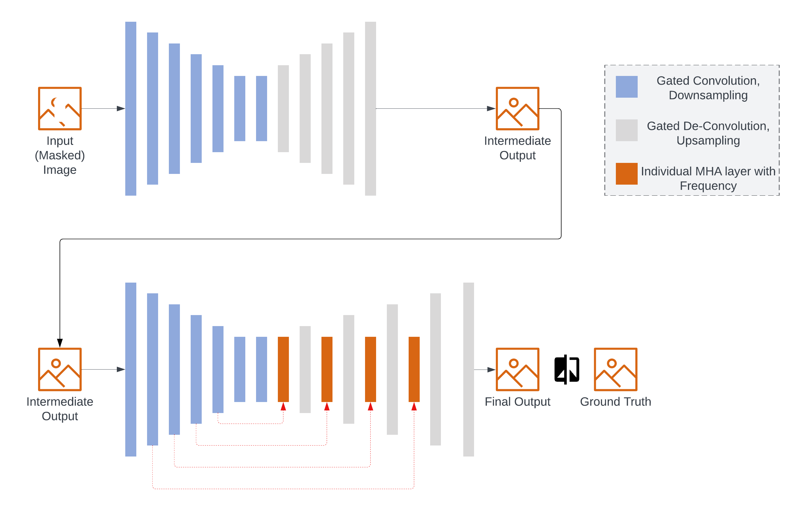
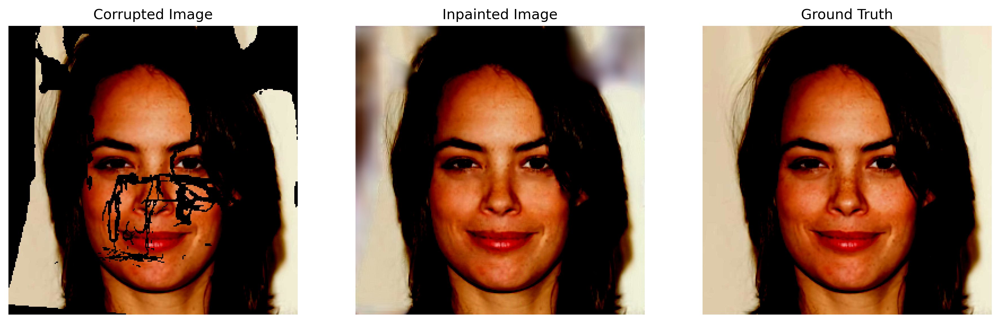
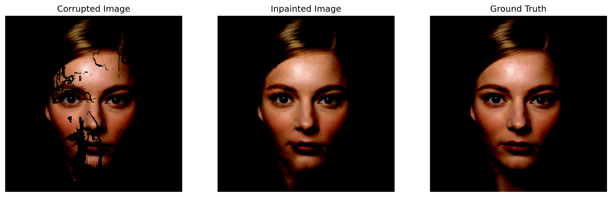

# Frequency Deformable Multi-Head Attention

This project involves solving image inpainting, or filling corrupted images with plausible content, for the CelebAHQ dataset. The resulting network is a compact 3.5 million parameter U net architecture: 

  

  

Here are some of the examples of inference of the current model. On the left there is an input image (with the mask applied), inpainted image in the middle and model output is on the right.

  

  

The original dissertation contains two main implementations for image inpainting: **Simplified** and **Frequency**. In this repository, only the Frequency approach is present, with the specific combination of the overall network and added frequency processing component.

### Training

1. **Download the dataset:**
   [https://drive.google.com/drive/folders/1fxrBKYsuFCT6NI2pPgWQN9NloqSdCfMg?usp=drive_link]

2. **Data Setup:** Place the downloaded dataset folders under the `dataset` directory, like so:
  
Frequency/dataset/  
  
3. **Possible further Adjustments:** Consider fitting the hyperparameters to match your exact setup. For instance, if you have a GPU with >40GB VRAM, consider changing the learning rate accordingly.


4. **Start the training run with the following command:**

```python3 main.py```

### Inference

1. **Acquire the samples:** Either separate the masks into proportions (make sure you're only using last three thousand test images), or download a set of medium-sized images and corresponding masks (in the range of 0.2-0.4) using the same dataset link as above. If inferencing the whole dataset, make sure to uncomment and use the lines in test.py which split the dataset.

2. **Place Data in Dataset Folder:** Place these images and masks under the `dataset` directory.

3. **Download Checkpoints:**
    [https://drive.google.com/drive/folders/1cTqxXHxRPgYSPpTTFC74pAEhPbBCoEah?usp=drive_link]


4. **Run inference with the following command:**

```python3 test.py```
